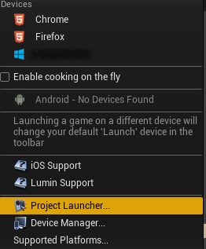
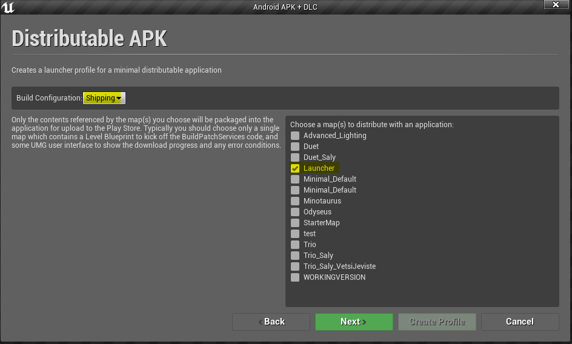

# LaternaVR

## Nastavení prostředí pro sestavení projektu

Aby bylo v Unrealu možné sestavit projekt pro platformu Android, je nutné splnit následující požadavky:

 - Instalace Android SDK (pro sestavení aplikace a vytvoření balíčku).
 - Instalace Android NDK (pro kompilaci nativního kódu).
 - Instalace MS Visual Studia 2017 nebo 2019 je nutná pro snadnou úpravu projektu (kódu) na PC.

### Microsoft Visual Studio (pro práci s projektem na PC)

https://visualstudio.microsoft.com/downloads/

Ke kompilaci kódu hry (C++) Unreal potřebuje instalaci vývojového prostředí MS Visual Studio 2017 nebo 2019.
Aby bylo možné instalaci Visual Studia s Unrealem použít, musí být při instalaci (nebo dodatečně) zvolen k
instalaci balíček “Game development with C++.”


### Android SDK

https://developer.android.com/studio#downloads

Instalaci Android SDK je možné provést dvěma způsoby.

#### Instalace skrz Android Studio

Android Studio poskytuje grafické uživatelské rozhraní pro instalaci Android SDK. Zároveň obsahuje instalaci
běhového prostředí Java, které Unreal pro tvorbu Android aplikace vyžaduje také.

#### Instalace pomocí příkazové řádky

Alternativně lze místo Android Studia stáhnout balíček sdk tools (na stejné stránce, níže). Po rozbalení je 
pak nutné programem sdkmanager (tools/bin) stáhnout zbytek nutných součástí Android SDK:

```sh
# nejprve je nutné odsouhlasit licenční podmínky
sdkmanager --licenses
# následně lze začít instalovat balíčky
sdkmanager platform-tools platforms:android-28 extras;android;m2repository extras;google;m2repository
```

### Android NDK

https://developer.android.com/ndk/downloads/older_releases.html

Po stažení příslušného balíčku z výše uvedeného odkazu (aktuálně projekt používá verzi r14b, Windows 64-bit 
při sestavení v systému Windows) stačí archiv na libovolné místo rozbalit a výslednou cestu zadat do nastavení Unrealu.

### Nastavení Unreal Enginu
Nastavení Android SDK, NDK a Javy je sdílené pro všechny projekty (ačkoliv se nastavuje v dialogu Project Settings).
Cesta k nastavení je z horního menu následující:

`Edit -> Project Settings... -> vlevo sekce Android SDK`


Zvýrazněná nastavení je nutné vyplnit, API Level lze nechat na posledním (latest). Pokud je k získání Android SDK použito
Android Studio, je možné použít v něm obsaženou instalaci Javy. Alternativně je nutné Javu nainstalovat zvlášť.

V implementaci Google Cardboard Unreal Enginu verze 4.22 existuje chyba, která brání správnému spuštění aplikace:
https://issues.unrealengine.com/issue/UE-65983

Řešením je:
  - Stáhnout Unreal Engine verze 4.20
  - Z verze 4.20 vzít složku Engine/Source/ThirdParty/GoogleVR
  - Tím nahradit stejnojmennou složku v Unreal Enginu verze 4.22 (opět Engine/Source/ThirdParty/GoogleVR)
Následně by sestavená aplikace měla se měla normálně spustit.

## Sestavení projektu

### Nastavení projektu

Aby bylo možné výsledný .apk soubor nahrát na Google Play jako novou verzi, musí být zvýšeno číslo Store Version v nastavení projektu.


Musí být také správně nastaveno podepisování balíčku (již by mělo být, nicméně pro úplnost).


Alternativně lze vše nastavit v konfiguračním souboru `Config/DefaultEngine.ini` ve složce projektu:

```ini
[/Script/AndroidRuntimeSettings.AndroidRuntimeSettings]
…
StoreVersion=1
…
KeyStore=...
KeyAlias=...
KeyStorePassword=...
KeyPassword=
```

Dále pak v souboru `Config/Android/AndroidEngine.ini` lze nastavit adresu serveru, odkud bude aplikace stahovat metadata:

```ini
[SystemSettings]
AndroidDLCServer="service.iim.cz"
```

### Sestavení pomocí Unreal Editoru

Před sestavením je nejprve třeba zkontrolovat, že je balení projektu nastavené na distribuční. Nastavení se nachází
ve stejném okně, jako nastavení Android SDK.


Dalším krokem je vytvoření konfigurací pro sestavení projektu ve více částech (hlavní aplikace a stažitelný obsah).
V nabídce `Launch (šipka vedle) -> Project Launcher…`


Je sekce Custom Launch Profiles, kde je v nabídce šipky
(vedle plus, v záhlaví sekce) možnost `Minimal Android APK + DLC`.


V následujícím okně je nejprve třeba zvolit, kam má být výsledná aplikace a obsah uložen (ideálně prázdná složka).
Na další obrazovce je pak volba map, které mají být obsaženy v aplikaci. Jediná obsažená mapa by měla být “Launcher,” která
obsahuje menu pro stažení a spuštění dalšího obsahu. Volba “Build Configuration” by měla být nastavena na “Shipping”
pro distribuci (Google Play Store), alternativně Development, pokud jde jen o vývojové sestavení.


V další části dialogu je třeba zvolit alespoň jeden formát textur (alespoň Android_ETC1) a právě jednu mapu s představením.
Další představení je pak možné nastavit v profilu po jeho vytvoření, místo toho zvoleného zde.


Pokud se jedná o sestavení aplikace, které má být nahráno na Google Play Store, musí být jak pro APK, tak pro DLC, profil upraven (ikona klíče a šroubováku).
V sekci `Release / DLC / Patching Settings` musí být zaškrtnuta volba “Create a release version of the game for distribution.”



Po vytvoření a nastavení profilů se jejich spuštěním rozběhne sestavení aplikace a DLC.
Je důležité nejdříve spustit profil pro APK aplikace, až potom jednotlivá DLC.
Pro sestavení více DLC stačí otevřít nastavení stávajícího DLC profilu a v sekci `Cook -> Cooked Maps` nechat samotnou zvolenou jinou mapu (mapu s jiným představením).


Výsledná aplikace po sestavení je uvnitř podsložky App složky, který byla zvolena k umístění výsledných souborů.
V podsložce HTTPChunks se pak nachází sestavené DLC.

### Sestavení pomocí připraveného skriptu

Ve složce projektu je Python skript `AndroidBuild.py` a soubor s nastavením `settings.py`.
Po nastavení projektu (sekce výše) a nastavení hodnot v `settings.py` stačí spustit `AndroidBuild.py`. Skript provede sestavení aplikace a všech
určených DLC do nastavené složky, zkopíruje videa a sestaví soubor `dlclist.json`.

Výsledkem je v nastavené složce struktura, která lze téměř celá rovnou umístit na server jako statický obsah.


## Poznámky ke změnám na mobil vůči originálu

### Tvorba obsahu

Velikost textur by měla být mocninou 2. Narazil jsem např. na textury o velikosti 3000x3000 (všechny tři Carpet_Laterna_*), které pak nejdou jednoduše redukovat.

Pozor na složitost modelů. Nedůležité modely max. v řádu 100 trojúhelníků, důležité ideálně v řádu 1000, max. 10000 trojúhelníků.

Co se modelů s kostrami týče, na mobilu jsou omezené na maximálně 75 kostí a nanejvýše 4 váhy na vertex, jinak se nezobrazí. Lze částečně opravit přímo v Unrealu,
ale lepší dodržet při tvorbě modelu.

### Změny pro mobil

Pak jsou některé části scén, pro které se na Androidu musí použít alternativní řešení.
Co zatím vím, že na Androidu nefunguje a musí se nahradit něčím jiným:

  - Jakákoliv světla kromě tří základních (directional, point, spot) na mobilu nefungují, ty základní jen statická nebo movable (movable mají omezení na 1x directional, 4x point, 4x spot).
  - Dynamické stíny nejsou, jedinou možností je directional světlo, kde by se pravděpodobně nějaké stíny zprovoznit daly, s příslušnou újmou na kvalitě.
  - Projekce pomocí materiálu v "Light Function" u spot světel (projekce na šály) nefungují. Nahrazuji mapováním projekce přímo na její cíl. Tímhle způsobem můžu mapovat ale jen 1-2 různá videa. Počet projektorů sice bude mít vliv na výkon, ale cca do 5 by to neměl být problém, pokud budou promítat stejné video.
  - Post-processing efekty kvůli způsobu vykreslování na mobilu nejdou, nebo by byly příliš pomalé.
  - Materiály jsou na Androidu omezenější a jednodušší, takže se k nim světlo chová trochu jinak.

### Detaily k rozdělení aplikace do DLC

DLC by měla být vždy sestavovany až po sestavení hlavní aplikace.
Další DLC lze pak přidávat bez nutnosti znovu sestavit hlavní aplikaci, pokud neobsahuje nový C++ kód nebo blueprinty s nastaveným
překladem na nativní kód. V takovém případě je nutné vytvořit nové sestavení aplikace. 

## Google Play Store

Pro nahrání nové verze aplikace na Google Play je třeba:

  - Přihlásit se do Google Play konzole na https://play.google.com/apps/publish/
  - Zvolit aplikaci LaternaVR
  - Přejít do sekce Správa vydání -> Vydání aplikace (anglicky Release management -> App releases), viz. obrázek níže
  - Kliknout na Spravovat (Manage) u příslušného kanálu (produkční/otevřená beta pro veřejná vydání, uzavřená alfa nebo interní test pro neveřejná vydání)
  - Kliknout na tlačítko Vytvořit vydání (Create release) a vyplnit formulář (včetně nahrání nového APK aplikace)



## Server se statickým obsahem

Poskytnutý skript na sestavení aplikace a DLC již tvoří příslušnou strukturu složek, nicméně krom souboru dlclist.json je jedno,
kde jsou ostatní data uložena, pokud jejich umístění souhlasí s cestou uvedenou v souboru dlclist.json.

Formát souboru `dlclist.json`:
```json
{
  "items": 
  [
    {
      "version": <cele cislo verze dlc>
      "dlc_name": "Nazev DLC",
      "description": "Popis DLC, který bude v aplikaci zobrazen.",
      "dlc_level": "Jmeno_Levelu_Ke_Spusteni",
      "dlc_size": <velikost dlc v bytech>,
      "banner_url": "datovy.server/cesta/k/obrazku/zahlavi/banner.png",
      "manifest_url": "datovy.server/cesta/k/souboru/NazevDLC.manifest",
      "clouddir_url": "datovy.server/cesta/k/adresari/CloudDir",
      "movies":
      [
        {
          "url": "datovy.server/cesta/k/souboru.mp4",
          "name": "soubor.mp4",
          "hash": "<32 znaku MD5 hash souboru>"
        }
      ]
    }, { … další záznamy }, …
  ]
}
```

Všechny hodnoty obsahující adresu jsou bez specifikace protokolu, tu doplní aplikace sama (včetně případného přihlášení).
Hodnoty `<cele cislo verze dlc>` a `<velikost dlc v bytech>` je třeba nahradit číslem. Tento soubor musí být umístěn na cestě
uvedené v blueprintu assetu `Launcher_Main_Menu` v proměnné `MetadataPath`.

